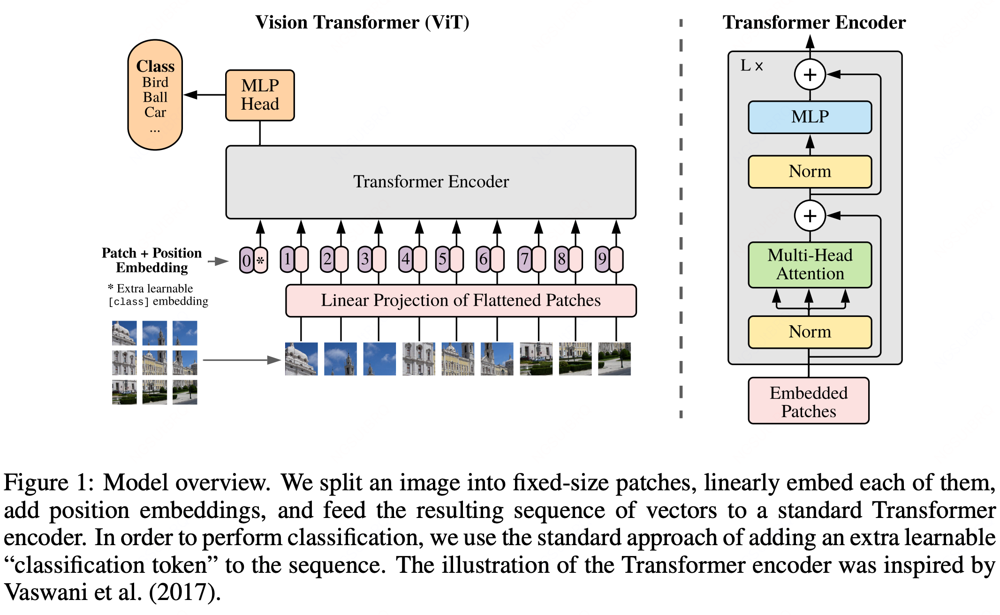
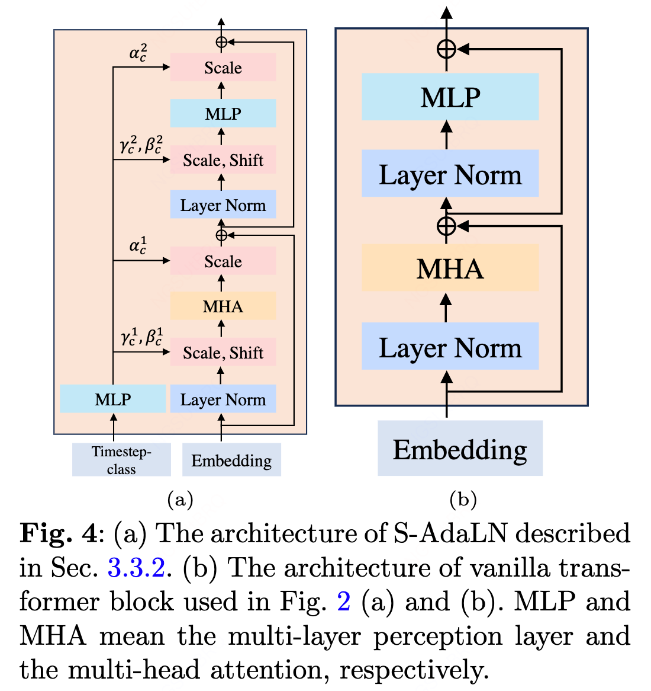
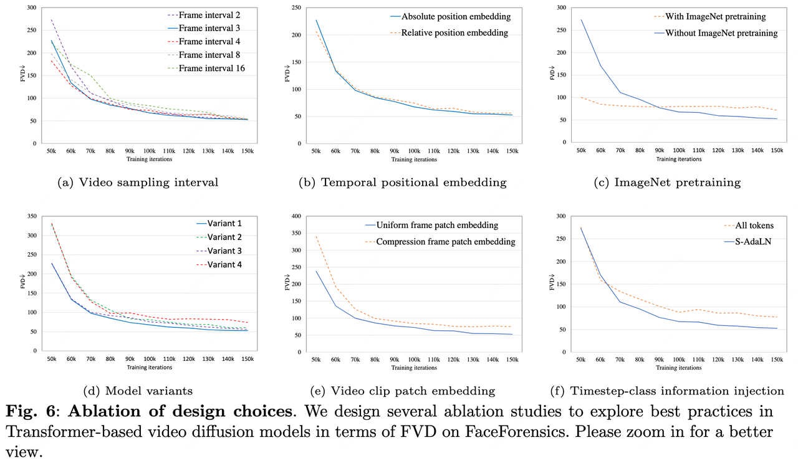
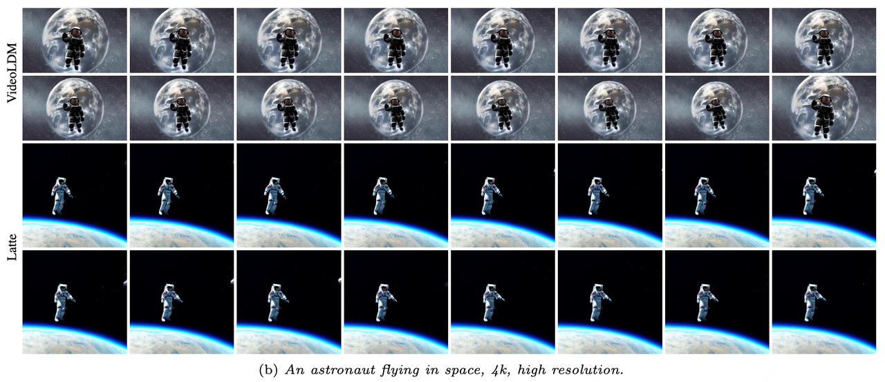

# Latte：Latent Diffusion Transformer for Video Generation

**项目主页**：[Latte](https://maxin-cn.github.io/latte_project/)

**背景介绍**：上海人工智能实验室“ [书生·筑梦](https://vchitect.intern-ai.org.cn/) ”系列（Vchitect）视频生成模型之一，央视的中国首部AI动画《 [千秋诗颂](https://tv.cctv.com/2024/02/26/VIDAUw4U4rxtLHnKuKP9dFZV240226.shtml) 》就使用了 Vchitect 的技术，制作效率提升30%以上。Latte 在 Sora 发布后短期内 github 星数达到 700+，有人复现后发现效果确实不错。“Latte” 意大利语牛奶咖啡，就是我们常说的“拿铁”，可能作者肝论文时咖啡喝多了......

言归正传，Latte 是一种新的潜空间 Diffusion Transformer（Sora的同源技术，简单理解为将扩散模型中 U-Net 替换为 Transformer ），用于视频生成。Latte 首先从输入视频中提取时空 tokens，然后用 Transformer 对潜空间中的视频分布建模，并且文中设计了4种Transformer 变体。为了提高视频生成质量，文中实践了多种 trick，包括**视频 patch embedding 方式、模型结构改进、Timestep-class 信息融合、时序位置 embedding、学习策略**等。最终在四个标准视频生成数据集（FaceForensics、SkyTimelapse、UCF101 和 Taichi HD）中实现了 SOTA 。此外可以将 Latte 扩展到文本视频生成（T2V）任务，这部分也提供了开源模型，但由于数据量和质量等原因目前和 Sora 差距还比较大。

## 一、核心技术

### 1.1 整体架构

和 [Stable Diffusion](https://stable-diffusion-art.com/how-stable-diffusion-work/) 原理基本一致，首先使用 VAE 压缩视频，提取视频 patch 组成 tokens，然后进行扩散-去噪过程，区别在于使用 Transforme r替换 U-Net 预测噪声的均值和方差，并且噪声是4维的，最后解码成视频。

**输入**：视频片段经VAE压缩后假设为 $F·H·W·C$，编码后得到 tokens $Z$，维度为$n_f·n_h·n_w·d$， $Z$ 和位置时空位置编码  $p$ 相加构成Transformer的输入 $Z'$。

**主干网**：
a）首先将输入 reshape 成 $Z_s$，维度为$n_f·t·d$，其中 $t=n_h·n_w$ ，先过空间Transoformer block，然后 reshape 成 $Z_t$，维度为$t·n_f·d$，过时间 Transformer block，循环几次。
b）类似a，只是先一组空间再一组时序。
c）a、b都使用完整的 Tranformer block 学习单一时间或空间信息，c是修改了 Tranformer block 内部结构，MHA 先在空间维度计算自注意力，然后在时间维度计算。这样每个 Tranformer block 就相当于融合了时间和空间信息。
d）在 Tranformer block 内部将 MHA 分成了两部分，一部分计算空间，一部分计算时间，最后再融合。

**输出**：解码得到噪声均值和协方差，二者维度同样为 $F·H·W·C$

附原版 [ViT Transformer](http://arxiv.org/abs/2010.11929) 架构：

### 1.2 视频 patch embedding

Patch embedding 是在潜空间进行的，文中图示使用了原视频帧方便展示：

1）所有帧都使用 [ViT](http://arxiv.org/abs/2010.11929) 的 patch 方式，类似平面操作，这样 $n_f=F, n_w=W/w，n_h=H/h$，$w$ 和 $h$ 表示每个 patch 的大小。
2）使用 [ViViT](https://arxiv.org/pdf/2103.15691v2.pdf) 的方式，在时序上采样 $s$，类似立体操作，这样 $n_f=F/s$

### 1.3 Timestep-class 信息融入

Timestep 以及 class 信息 $c$ 注入到模型采用了两种方式：

* 作为 tokens 加到输入中
* 使用 [DiT](https://arxiv.org/abs/2212.09748) 的自适应层归一化 AdaLN 方式，$c$ 先通过 MLP 计算出 $γ_c$ 和 $β_c$，这样 $AdaLN(h, c) = γ_c{\text{LayerNorm}}(h)+β_c$，其中 $h$ 为隐藏向量。本文又新增了一个 scale 向量 $α_c$，应用在所有残差连接中，最终 $RCs(h, c) = α_ch + AdaLN(h, c)$，取了个名字叫 S-AdaLN。

### 1.4 空间位置 embedding

文中只提到了时序位置编码方式，空间位置应该就是使用默认方式。时序位置有两种方式，绝对位置编码和相对位置编码 [RoPE](https://arxiv.org/abs/2104.09864)，实验证明两种方式区别不大。

### 1.5 学习策略

##### 使用预训练模型

使用了 [DiT](https://arxiv.org/abs/2212.09748) 的在 ImageNet 上的预训练模型，并作了一些改进，比如 DiT 位置编码 embedding 维度是 $n_h·n_w·d$，但是 Latte 的时空位置编码 embedding 维度是 $n_f·n_h·n_w·d$ ，于是就复制了 $n_f$ 份。此外还去掉了 label embedding layer。

##### 图像-视频联合训练

基于 CNN 的视频生成方法提出图像和视频同时训练提升明显，本文将该技术应用到了Transformer 架构中，具体做法是在视频后面随机添加一些同一数据集其它视频的帧用于图像生成任务，时序相关的 tokens 只作用在视频部分。

## 二、实验结论

### 2.1 无条件生成视频

##### 实验配置

训练时每个视频固定抽16帧，resize到 256×256，数据增强只用了随机水平翻转，使用AdamW 优化器和 EMA，VAE来自SD1.4。

##### 评价标准

- FVD：Fréchet Video Distance，基于 FID 原理，将特征提取网络换成3D模型。FVD 与人类判断有很好的相关性，会完整地查看视频，避免了逐帧指标的缺点。FVD 指标越小，视频质量越高，也是本文的重点关注指标。
- FID：Fréchet Inception Distance，生成样本和真实样本在 Inception 特征空间的距离。
- IS：Inception Score，评价生成图像的质量和多样性，越高越好。质量指生成图像输入到 Inception 得到的分类分数越高，说明生成的该物体质量越好。

##### 实验结论

- **抽帧间隔**：最终结果差距不大，文中抽帧间隔使用3。
- **时序embedding**：差距不大，绝对位置编码略优。
- **ImageNet预训练模型**：开始收敛快，后劲不足，主要在于数据分布差异。
- **Transformer变体**：方式一最优，其它变动没啥收益。
- **视频 patch embedding**：与 [ViViT](https://arxiv.org/pdf/2103.15691v2.pdf) 的结论相反，二维效果更好。时序压缩会丢失信息？
- **Timestep-class信息融入**：S-AdaLN 遥遥领先，加在 tokens 只作用在输入层，而S-AdaLN 作用在每一层。
- **模型尺寸**：越大越好。
- **图像+视频联合训练**：效果很好！

##### 模型对比

在评测数据集上取得了SOTA：

### 2.2 文生视频

使用 [WebVid-10M](https://github.com/m-bain/webvid) 和 Vimeo25M 数据集训练，包含33w文本-视频对。

## 三、总结

Latte是目前相对完整的开源文生视频项目，原理和大家猜测的 Sora 原理基本一致，差距主要体现在数据上，OpenAI 可以内部工具闭环，这是很大的优势。Latte 目前是各大社区复现 Sora 的首选 baseline，可以帮助深入理解文生视频链路和技术细节。文中没有提及任意分辨率视频生成，这个技术可以在后续工作中加入。

